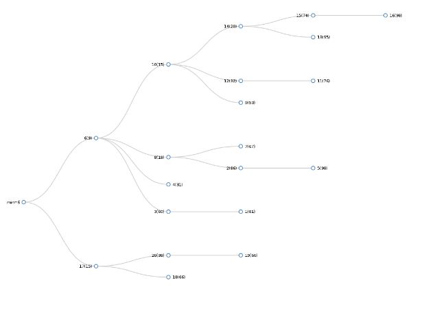

fib_heap
========

Fibonacci Heap Implementation for C++

References: [Fibonacci Heaps and Their Uses in Improved Network Optimization Algorithms - Fredman, et al.](http://www.cl.cam.ac.uk/~sos22/supervise/dsaa/fib_heaps.pdf)

#Notes
This was primarily implemented for use in [Prim's Algorithm](http://en.wikipedia.org/wiki/Prim's_algorithm). Graph vertecies are stored in the heap, and ordered by an edge weight associated with each vertex. As such, each node in this implementation takes a vertex integer and weight integer and the heap uses the weight property for organization. 

```c++
struct node
{
    int rank;
    char mark;
    
    int vertex;
    int weight;
    
    node* parent;
    node* child;
    node* left;
    node* right;
};
```

#Heap Operations
This section will detail how to implement common heap operations using this library, and lists the amortized running time for each as described in Fredman, et al.
####Creating a Heap

```c++
FibonacciHeap F;
```
####Extract Min O(log(n))
```c++
node* h = F.Extract_Min();
```
####Insert O(1)
Returns a pointer to that node so that you can directly reference it later for Decrease_Key() operations.
```c++
node* h = F.Insert(int weight,int vertex);
```
####Decrease Key O(1)
Weight is set to new value for given node, and heap is reshuffled if the new weight violates the heap. 
```c++
F.Decrease_Key(node* h, int weight); 
```
####Display Heap (Only use on small heaps, ~100 nodes)
Publishes tree to fib.json, open fib.html to view this in D3.




```c++
F.Display_Heap();
```
